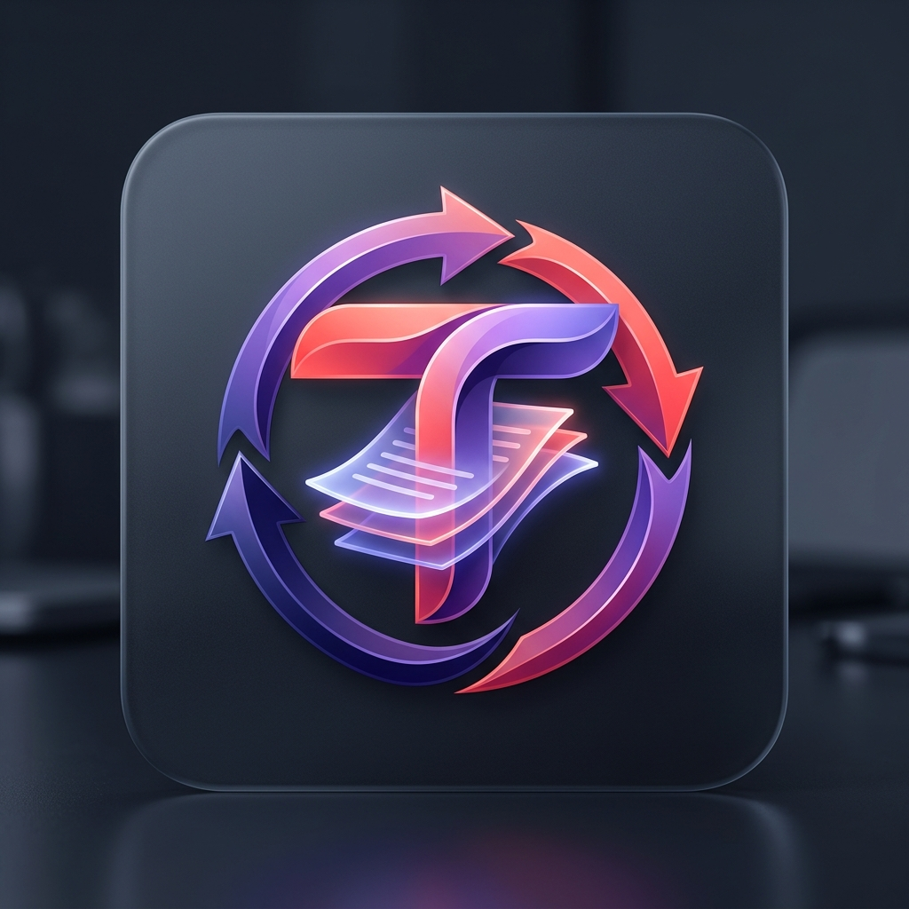

<div align="center">

  

  # Tdoc - All-in-One Client-Side Document Converter

  **Platform Konversi & Editor Dokumen Serbaguna Cepat, Gratis, dan 100% Privasi Terjamin.**

  [](https://react.dev/)
  [](https://vitejs.dev/)
  [](https://www.typescriptlang.org/)
  [](https://tailwindcss.com/)
  [](#-arsitektur--privasi)

</div>

---

## 🌟 Tentang Tdoc

**Tdoc** adalah platform web konversi dan pengolahan dokumen modern yang terinspirasi dari iLovePDF. Dibangun menggunakan **React 19**, **TypeScript**, dan **WebAssembly/V8 Engine**, seluruh pemrosesan dokumen dilakukan secara **100% Client-Side** di dalam browser pengguna. Dokumen Anda tidak pernah diunggah ke server mana pun, menjamin privasi dan keamanan data tingkat tinggi.

---

## ✨ Fitur Unggulan

### 📑 Pengolahan PDF (*PDF Tools*)
- **Merge PDF:** Menggabungkan beberapa file PDF menjadi satu file utuh secara berurutan.
- **Split PDF:** Memisahkan halaman PDF berdasarkan rentang kustom (`1-3, 5, 8-10`) atau pratinjau thumbnail interaktif.
- **Compress PDF:** Mengecilkan ukuran file PDF dengan 3 pilihan level kompresi (*Direkomendasikan*, *Ekstrim*, atau *Rendah*) beserta persentase penghematan ukuran.
- **Nomor Halaman PDF:** Menambahkan nomor halaman otomatis dengan dukungan **Angka Arab (1, 2, 3)**, **Romawi Kecil (i, ii, iii)** untuk skripsi/kata pengantar, dan **Romawi Besar (I, II, III)**.
- **Rotate PDF:** Memutar orientasi halaman PDF (90°, 180°, 270°) secara visual.
- **Urutkan Halaman PDF:** Mengatur ulang posisi halaman PDF secara visual.

### 🖼️ Konversi Gambar & Keamanan
- **JPG / PNG / WebP to PDF:** Mengubah kumpulan foto/gambar menjadi PDF dengan opsi Orientasi (*Portrait/Landscape*) dan Margin.
- **PDF to JPG / PNG:** Ekstraksi halaman PDF menjadi gambar berkualitas tinggi (PNG/JPG).
- **Watermark PDF:** Menambahkan watermark **Teks** atau **Upload Logo Gambar (PNG/JPG)** perusahaan/universitas dengan kontrol ukuran logo & transparansi (*opacity*).

### 📝 Konversi Dokumen Office
- **Word (.docx) to PDF:** Mengonversi file dokumen Microsoft Word (`.docx`) secara langsung menjadi PDF resolusi tinggi.
- **PDF to Word (.docx) / Text:** Mengekstrak isi teks PDF menjadi dokumen Word yang dapat diedit atau file teks mentah (`.txt`).

---

## 🔒 Arsitektur & Privasi

```
 ┌─────────────────────────────────────────────────────────────┐
 │                      User's Browser                         │
 │                                                             │
 │  ┌──────────────┐    ┌─────────────────┐   ┌─────────────┐  │
 │  │ File Input   │ ──►│ pdf-lib / pdfjs │──►│ Output File │  │
 │  └──────────────┘    └─────────────────┘   └─────────────┘  │
 └─────────────────────────────────────────────────────────────┘
                ▲ NO SERVER UPLOADS - 100% PRIVATE
```

- **0 Upload Server:** Dokumen sensitif tidak pernah meninggalkan perangkat pengguna.
- **Skalabilitas Tanpa Batas:** Pemrosesan memanfaatkan V8 Engine & WebAssembly lokal di komputer pengguna.
- **Bisa Dihosting 100% Gratis:** Tidak memerlukan server backend/VPS mahal.

---

## 🛠️ Stack Teknologi

| Komponen | Teknologi yang Digunakan |
| :--- | :--- |
| **Frontend Framework** | React 19, TypeScript |
| **Build Tool & Bundler** | Vite 8.2 |
| **Styling & UI** | Tailwind CSS v4, Lucide Icons, Glassmorphism CSS |
| **Engine Manipulasi PDF** | `pdf-lib`, `pdfjs-dist`, `jsPDF` |
| **Parser Dokumen Office** | `mammoth`, `docx`, `html2canvas` |
| **Visual Delights** | `canvas-confetti` |

---

<div align="center">
  <sub>Dibuat dengan untuk pemrosesan dokumen yang cepat, aman, dan mudah.</sub>
</div>
